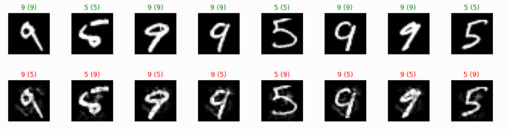

# 手写数字分类数据投毒

## 一、题目简介

机器学习模型的训练效果高度依赖训练数据的质量，而训练数据在采集、标注与共享环节存在被篡改的风险。本题围绕"手写数字图像分类"这一基础任务，考查数据投毒攻击与防御两方面的能力：攻击方需要在有限的数据修改预算内对训练集进行投毒，使基于投毒训练集训练出的分类模型在干净测试集上的整体分类性能显著下降；防御方则在不知道哪些样本被篡改、也不知道攻击手段的前提下，对可能被投毒的训练集进行检测、清洗、纠正或鲁棒训练，使最终模型的分类性能尽可能恢复。通过攻防双方的对抗与评测，考查对训练数据可信性与模型鲁棒性的综合理解与实现能力。

## 二、算法原理

### 2.1 攻击方原理

攻击方的总体目标是：在给定的投毒预算内，通过修改训练集中的样本——例如篡改标签、叠加噪声扰动、构造具有特定统计特征的样本——破坏训练数据的"干净"假设，使模型学习到错误或混乱的输入输出映射，从而在隐藏的干净测试集上表现为整体准确率下降。攻击方获得干净的训练数据 $\text{train\_images}$ 与 $\text{train\_labels}$，需要返回修改后的 $\text{poisoned\_images}$ 与 $\text{poisoned\_labels}$，输出数据规模必须与原训练集一致，且被修改的样本数不得超过投毒预算：

$$
N_{\text{modified}} \le \lfloor \text{PoisonRate} \times N_{\text{train}} \rfloor
$$

常见攻击思路可分为两大类：**标签篡改**，即保持图像内容不变、只改变样本标签，直接破坏监督信号；**特征扰动**，即保持标签不变但修改图像内容（如高斯噪声、椒盐噪声等），迫使模型学习错误的视觉特征。

**Baseline：随机标签翻转（Random Label Flip）**。该算法是标签篡改类攻击中最简单、最具代表性的基线，代码接口为 `attack(images, labels, poison_rate=0.05, seed=42) -> {"images", "labels"}`：输入为干净训练集（`images: [N, 1, 28, 28] float32`，`labels: [N] int64`），输出为与原集规模一致的投毒数据。其原理是：从训练集中均匀随机选取 $N_{\text{modified}}$ 个样本，将每个样本的标签随机翻转为与其原标签不同的任意一个类别。由于被翻转的样本携带错误的监督信号，模型在拟合这些样本时会学习到错误的映射关系，决策边界被扰乱，整体准确率随之下降。实现步骤为：① 根据投毒预算计算需修改的样本数

$$
N_{\text{modified}} = \max\left(1,\ \lfloor \text{PoisonRate} \times N_{\text{train}} \rfloor\right)
$$

（默认 $\text{PoisonRate} = 0.05$，且不超过样本总数）；② 用固定随机种子（默认 42）构造随机数生成器，从 $N_{\text{train}}$ 个样本中**无放回**抽取 $N_{\text{modified}}$ 个索引，保证结果可复现；③ 对每个被选中的样本，在其原标签之外的其余 9 个类别中等概率随机选择一个作为新标签。该算法实现简单、时间复杂度为 $O(N_{\text{modified}})$、计算开销极低、对模型结构完全不可知（黑盒攻击），因此被广泛用作评估防御方法有效性的标准攻击基线。

<figure style="margin:10pt auto; text-align:center;">

<figcaption style="font-size:10pt; text-align:center; margin-top:4pt;">随机标签翻转（RandomLabelFlip）算法示意图</figcaption>
</figure>

### 2.2 防守方原理

防守方的总体目标是：在不知道攻击方法、不知道哪些样本被投毒的前提下，对可能受污染的训练集进行处理，使最终训练出的模型在干净测试集上的性能尽可能恢复到干净训练时的水平。防御思路主要分为三类：一是**数据清洗**（data cleaning），通过统计检验、离群检测或置信学习等方法识别并移除或纠正可疑样本；二是**样本重加权**（reweighting），对可疑样本赋予更小的训练权重，削弱其影响；三是**鲁棒训练**（robust training），如标签平滑、数据增强等，降低模型对个别异常样本的敏感度。防御方获得可能被投毒的训练集，需要返回清洗后的数据集，并可附带样本权重 $\text{sample\_weights}$ 与训练配置 $\text{train\_config}$ 供统一模型训练使用。

**Baseline：数据增强（Data Augmentation）**。该算法属于鲁棒训练类防御，是抵御数据投毒最常用且最稳健的基线之一，代码接口为 `defend(images, labels, seed=42, max_shift=2, copies=1) -> {"images", "labels"}`：输入为可能被投毒的训练集（`images: [N, 1, 28, 28] float32`，`labels: [N] int64`），输出为扩充后的数据集（规模变为原来的 $1+\text{copies}$ 倍）。其原理是：通过对训练样本施加微小的随机几何变换（如随机平移），为每个样本生成副本并入训练集，从而扩大有效样本量、引入平移不变性先验，提升模型的泛化能力，降低模型对个别异常（投毒）样本的敏感度。实现步骤为：① 保持图像与标签一一对应，对每个样本生成 $\text{copies}=1$ 份随机平移副本；② 每份副本的水平和垂直平移量 $(\Delta y, \Delta x)$ 在 $[-2, 2]$ 像素内均匀随机抽取（`max_shift=2`）；③ 平移通过循环移位（`np.roll`）实现，超出边界的像素回卷到图像对侧；④ 将原始样本与副本拼接，使训练集扩充为原来的 2 倍规模后交由统一模型训练。该方法实现简单、模型无关（对 MLP 与 CNN 均有效），时间复杂度为 $O(N_{\text{train}})$，且不依赖对攻击手段的任何假设，因此常被用作衡量更复杂防御方法增益的下界基线。

## 三、评估基准

为统一评测攻击与防御方法，本基准（Benchmark）定义了固定的数据集划分、训练协议与指标计算规则，所有方法均在相同条件下评测，保证结果公平可比。

### 3.1 数据集

本基准使用 **MNIST 手写数字数据集**（本项目代码目录内已内置离线缓存）。MNIST 是机器学习领域最经典的图像分类数据集之一，包含 $70{,}000$ 张 $28 \times 28$ 的灰度手写数字图像，覆盖 $0$–$9$ 共 $10$ 个类别，每张图像为 $784$ 维像素向量，像素值范围 $0$–$255$。该数据集类别均衡、标注可靠，且规模适中，单次模型训练仅需数秒，非常适合作为数据投毒攻防的评测基准。

数据集输入输出规范如下：

- **训练集与测试集的数据格式**规定为：

$$
\text{train} = \{\text{images}: [N_{\text{train}}, 1, 28, 28] \text{ float32，取值}[0,1]\text{，已归一化};\ \text{labels}: [N_{\text{train}}] \text{ int64，取值 } \{0,1,\dots,9\}\}
$$

$$
\text{test} = \{\text{images}: [N_{\text{test}}, 1, 28, 28] \text{ float32};\ \text{labels}: [N_{\text{test}}] \text{ int64}\}
$$

- 基准固定划分为 $8{,}000$ 张训练图像与 $2{,}000$ 张测试图像（随机种子 $42$ 打乱抽样），测试集在整个评测过程中保持干净、不参与任何训练，模拟"隐藏测试集"；
- **模型输入输出规范**：模型输入为单通道 $28 \times 28$ 图像，输出为 $10$ 个类别上的预测；基准采用统一的多层感知机（MLP，隐层 $[256, 128]$，ReLU 激活，Adam 优化器）作为分类模型，保证不同方法间评测公平；
- 若运行环境无网络且无内置缓存，基准自动回退到离线合成数据，保证评测流程总能跑通。

### 3.2 指标

定义 $Acc_{\text{clean}}$、$Acc_{\text{attack}}$、$Acc_{\text{defense}}$ 分别为在干净训练集、投毒训练集、防御后训练集上训练统一模型并在干净测试集上得到的分类准确率：

$$
Accuracy = \frac{\#\text{correct}}{N_{\text{test}}}
$$

**（1）投毒率（PoisonRate）**：攻击实际修改样本数占训练集的比例，衡量攻击是否遵守预算约束：

$$
PoisonRate = \frac{N_{\text{modified}}}{N_{\text{train}}}
$$

其中 $N_{\text{modified}}$ 为被修改（标签或图像发生变化的）样本数，基准要求 $PoisonRate \le 5\%$。

**（2）非定向攻击成功率（UntargetedASR）**：攻击造成的归一化整体性能下降，值越大表示攻击越成功：

$$
UntargetedASR = \max\left(0,\ \frac{Acc_{\text{clean}} - Acc_{\text{attack}}}{Acc_{\text{clean}}}\right)
$$

**（3）攻击成功判定（AttackSuccess）**：当 $Acc_{\text{attack}} < Acc_{\text{clean}} - \Delta$ 时判定攻击产生有效破坏，基准取 $\Delta = 0.05$（即 5 个百分点）。

**（4）防御恢复率（RecoveryRate）**：度量防御方法相对"无防御"的恢复程度，截断到 $[0,1]$：

$$
RecoveryRate = \operatorname{clip}\left(\frac{Acc_{\text{defense}} - Acc_{\text{attack}}}{Acc_{\text{clean}} - Acc_{\text{attack}}},\ 0,\ 1\right)
$$

若攻击本身未造成有效准确率下降（分母接近 $0$），该对阵的恢复率不参与统计，避免除零。

**（5）防御后残余攻击效果（EffectiveASR）**：用于攻击 × 防御全对阵矩阵，刻画防御后仍然存在的攻击效果：

$$
EffectiveASR = \max\left(0,\ \frac{Acc_{\text{clean}} - Acc_{\text{defense}}}{Acc_{\text{clean}}}\right)
$$

**最终评分**：攻击方得分 = 其方法在所有防御方法对阵下的 $UntargetedASR$ 均值；防御方得分 = 其方法在所有攻击方法对阵下的 $RecoveryRate$ 均值。

**参考实测结果**：在默认参数（PoisonRate=5%、seed=42、统一 MLP）下实测，干净训练得到 $Acc_{\text{clean}}=0.9405$，随机标签翻转投毒后 $Acc_{\text{attack}}=0.9290$（$UntargetedASR \approx 0.012$，未达到 $\Delta=5$ 个百分点判定线——5% 对称标签噪声对 MNIST 属弱攻击，如实报告），数据增强防御后 $Acc_{\text{defense}}=0.9475$（$RecoveryRate = 1.0$）。
